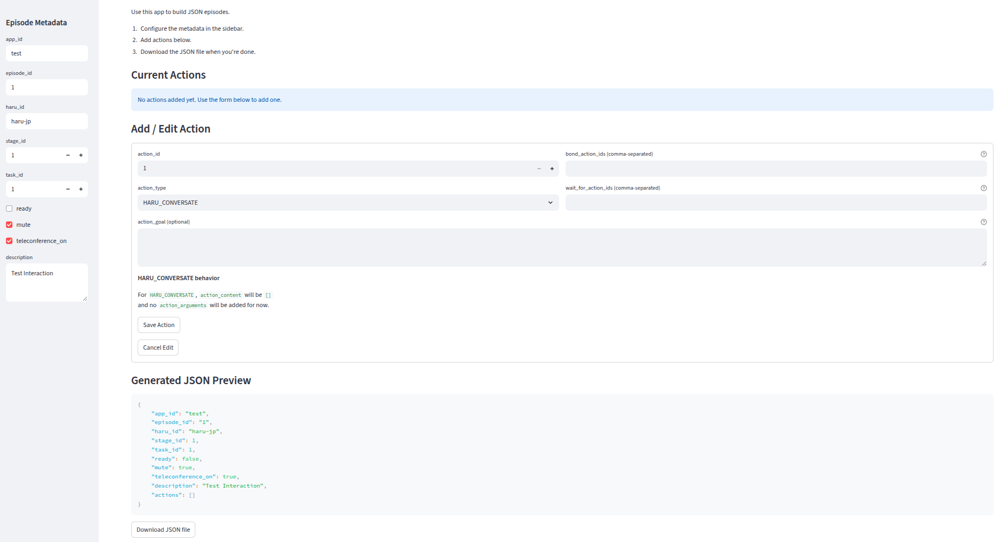

# Simple Haru Episode Builder

A lightweight Streamlit app for creating episode JSON files for the Haru social robot.  
The tool lets you define metadata, add actions, specify bonds, and export structured JSON files ready for use in Haru interaction pipelines.



---

## Features
- Simple Streamlit web UI  
- Auto-incrementing action IDs  
- Two action types:
  - `HARU_CONVERSATE`
  - `HARU_GAZE` (auto-fills gaze arguments)
- Support for bonded and waiting dependencies  
- Live JSON preview  
- One-click JSON download  

---

## Setup (Linux, using `uv`)

This project already includes a `pyproject.toml` with the required dependencies.

### 1. Create the virtual environment

```bash
uv venv
```

### 2. Activate the environment

```bash
source .venv/bin/activate
```

### 3. Install dependencies from `pyproject.toml`

```bash
uv sync
```

This installs everything listed under `[project.dependencies]` into the venv.

---

## Run the App

```bash
streamlit run haru_json_builder_app.py
```

Then open:

```
http://localhost:8501
```

---

## Usage Overview

### 1. Configure Episode Metadata
Specify:
- app_id / episode_id  
- haru_id  
- stage_id / task_id  
- ready / mute / teleconference flags  
- description  

### 2. Add Actions
Choose between:

#### HARU_CONVERSATE
- `action_content: []`
- No `action_arguments`

#### HARU_GAZE
Automatically inserts:

```json
{
  "gaze_arguments": {
    "gaze_mode": "TRACK_PERSON"
  }
}
```

### 3. Link Actions
Optionally configure:
- `bond_action_ids`
- `wait_for_action_ids`

### 4. Export Episode
Preview the generated JSON and download it in one click.

---
